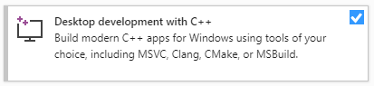

# Using Egern on Windows

The current build and test scripts assumes the following software is installed:
* [NASM](https://www.nasm.us/). Add it to the path.
* MSVC linker (`link.exe`). This comes bundled with [Visual Studio](https://visualstudio.microsoft.com/) when installing *Desktop development with C++*. Make sure to add it to the path.

* The *Universal C Runtime* (ucrt). These days this is shipped via the [Windows SDK](https://developer.microsoft.com/en-us/windows/downloads/windows-10-sdk/). Certain symbols, such as `printf`, aren't available in it, however (they have been refactored out, are inlined, among other things). To solve this we need the `legacy_stdio_definitions.lib` shipped with MSVC, which we luckily got when we installed compiler.

The current scripts rely on absolute paths that involve version numbers (check `run.cmd`). Update them as needed. In the future we might need a more general method for linking or a version freeze with set paths. If MSVC is installed to the standard location the linker is likely at: `C:\Program Files (x86)\Microsoft Visual Studio\2019\Community\VC\Tools\MSVC\14.24.28314\bin\Hostx64\x64`